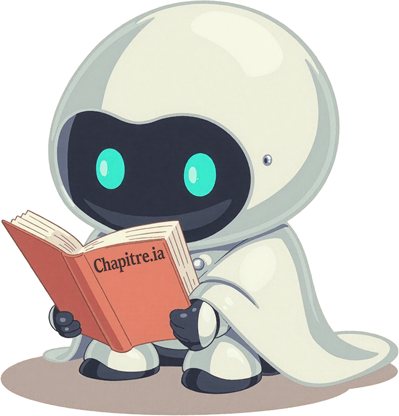

 

# Chapitre.ia

An interactive storytelling application powered by Large Language Models (LLMs).

## Features

- Python Flask backend with LLM integration
- Interactive narrative generation with user choices
- Vanilla JavaScript frontend with smooth animations
- Two interaction modes: multiple choice and free text input
- Typewriter effect for immersive story display

## Demo

[](https://youtu.be/VgjE2Dj4MnA)

## Installation

1. Clone this repository
2. Set up backend:

```bash
cd backend
pip install -r requirements.txt
```

3. Configure your LLM API:
   ```bash
   cd backend
   cp llm_apis.json.template llm_apis.json
   ```
   Edit `llm_apis.json` with your API credentials and desired model configuration
4. Start backend server:

```bash
python app.py
```

5. Open the application in your browser at `http://localhost:5000`

## How It Works

1. Enter your initial story prompt (setting, characters, etc.)
2. The application generates the first chapter of your story
3. Continue the story by:
   - Selecting from multiple choice options, OR
   - Providing your own text input when prompted
4. The story evolves based on your choices until reaching a conclusion

## Project Structure

```
backend/       - Python backend code (Flask server, LLM integration)
frontend/      - Interactive story interface (HTML/CSS/JS)
assets/        - System prompts and resources
```

## License

```text
Copyright 2025 YofarDev

Licensed under the Apache License, Version 2.0 (the "License");
you may not use this file except in compliance with the License.
You may obtain a copy of the License at

    http://www.apache.org/licenses/LICENSE-2.0

Unless required by applicable law or agreed to in writing, software
distributed under the License is distributed on an "AS IS" BASIS,
WITHOUT WARRANTIES OR CONDITIONS OF ANY KIND, either express or implied.
See the License for the specific language governing permissions and
limitations under the License.
